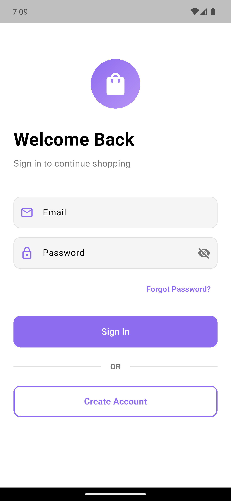
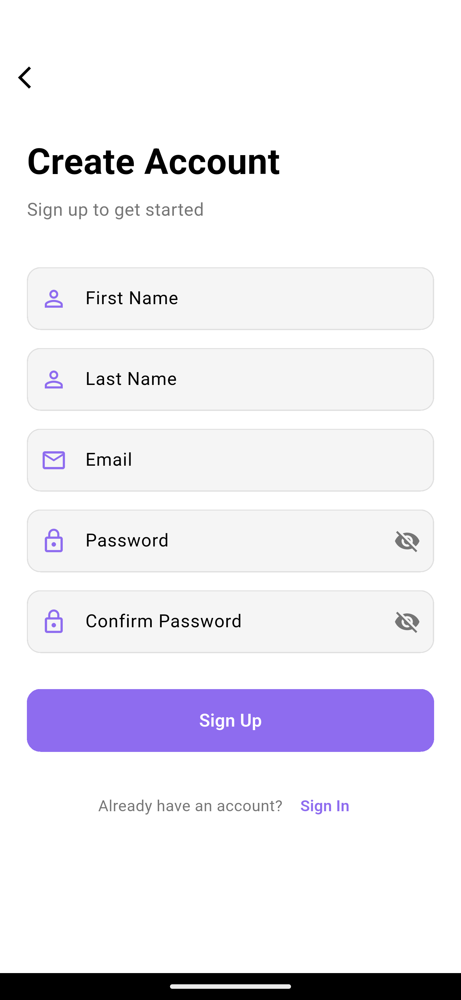
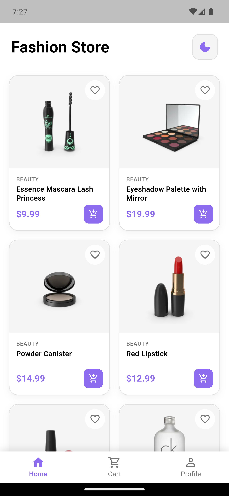
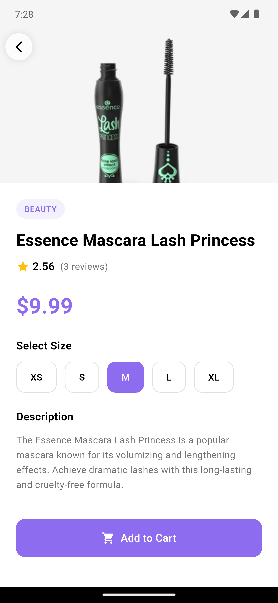
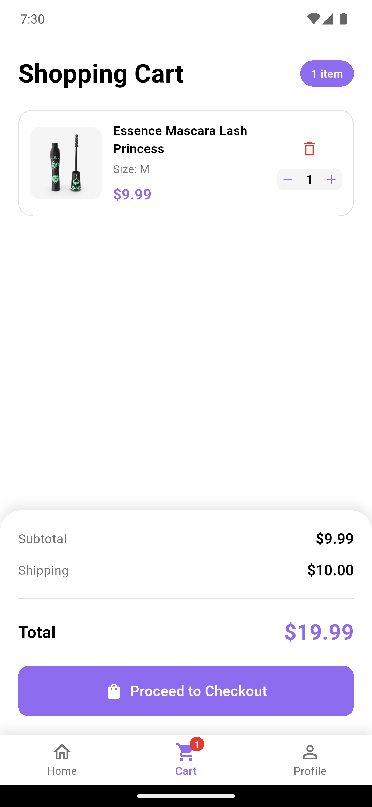
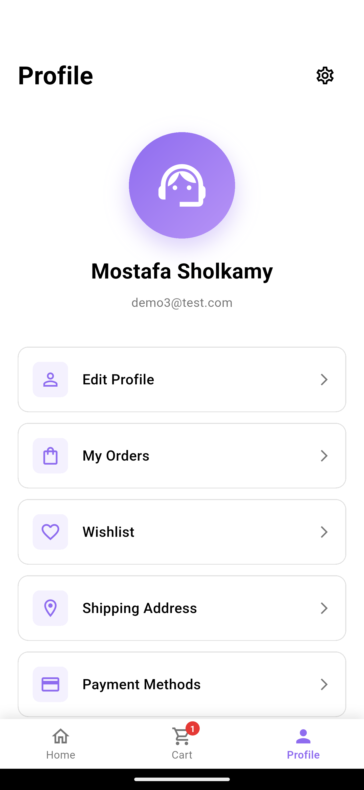
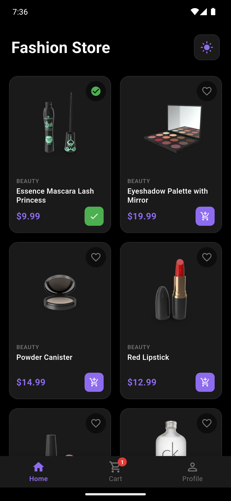

<div align="center">

# 🛍️ Fashion Store — Flutter E-Commerce App

A production-ready e-commerce mobile application built with **Flutter**, following **Clean Architecture** principles and using **Provider** for state management.

[](https://flutter.dev)
[](https://dart.dev)
[](https://firebase.google.com)

</div>

---

## ✨ Features

### 🔐 Authentication
- Email & password **Sign Up / Sign In / Sign Out** with Firebase Authentication
- **Forgot Password** — send a password reset link straight to the user's inbox
- User profiles stored in **Cloud Firestore** (first name, last name, email)

### 🏠 Home
- Clean header with **Fashion Store** branding
- Real-time product listing from the [DummyJSON API](https://dummyjson.com)
- 2-column responsive product grid with reusable `ProductCard` widget
- Light / Dark mode toggle

### 👕 Product Details
- Full product view — image, title, category, price and rating
- Quantity selector and "Add to Cart" action

### 🛒 Cart
- Add / remove products and update quantities
- Live cart summary: subtotal, shipping and total price

### 👤 Profile
- User data loaded from Firestore
- Customer-service avatar and logout

### 🌙 Theme
- Complete **Light / Dark** theme — every widget reacts instantly
- Theme preference is **persisted** with `SharedPreferences`

---

## 📸 Screenshots

| Login | Sign Up | Home |
|:-:|:-:|:-:|
|  |  |  |

| Product Details | Cart | Profile |
|:-:|:-:|:-:|
|  |  |  |

| Dark Mode |
|:-:|
|  |

---

## 🏗️ Architecture

The project follows **Clean Architecture** for scalability, maintainability and testability.

```
lib/
│
├── core/
│   └── app_colors.dart          # Brand colors + gradients
│
├── models/
│   ├── product.dart             # Product model
│   └── cart_item.dart           # Cart item model
│
├── services/
│   ├── auth_service.dart        # Firebase Auth + Firestore users
│   └── product_service.dart     # REST API (Fake Store API)
│
├── providers/
│   ├── cart_provider.dart       # Cart state management
│   └── theme_provider.dart      # Light/Dark theme + persistence
│
├── screens/
│   ├── login_screen.dart        # Sign in + password reset
│   ├── signup_screen.dart       # Create account
│   ├── main_wrapper.dart        # Bottom navigation shell
│   ├── home_screen.dart         # Product feed
│   ├── product_detail_screen.dart
│   ├── cart_screen.dart
│   └── profile_screen.dart
│
├── widgets/
│   ├── custom_button.dart
│   ├── custom_text_field.dart
│   └── product_card.dart
│
└── main.dart                    # App entry + auth gate
```

---

## 🛠️ Tech Stack

| Layer | Technology |
|---|---|
| **Framework** | Flutter (Material 3) |
| **Language** | Dart |
| **State Management** | Provider |
| **Authentication** | Firebase Auth |
| **Database** | Cloud Firestore |
| **Networking** | `http` + REST API |
| **Local Storage** | `shared_preferences` |
| **UI** | Google Fonts, Cached Network Image |

---

## 🚀 Getting Started

### 1️⃣ Clone the repository
```bash
git clone https://github.com/MShulkamy/final_project.git
cd final_project
```

### 2️⃣ Install dependencies
```bash
flutter pub get
```

### 3️⃣ Configure Firebase
1. Create a project on [Firebase Console](https://console.firebase.google.com)
2. Enable **Authentication → Email/Password**
3. Create a **Cloud Firestore** database
4. Register an Android app with your package name and download `google-services.json` into `android/app/`
5. (Optional) For web/desktop run:
```bash
dart pub global activate flutterfire_cli
flutterfire configure
```

### 4️⃣ Run the app
```bash
flutter run
```

---

## 📂 Project Structure Highlights

- **`auth_service.dart`** — all auth flows in one place: sign up, sign in, sign out and password reset, with human-readable error messages for every Firebase error code
- **`cart_provider.dart`** — add, remove, update quantity and compute totals
- **`theme_provider.dart`** — dynamic light/dark themes with saved preference
- **`product_service.dart`** — clean REST integration with error handling

---

## 👨‍💻 Author

**Mostafa Sholkamy** — Flutter & Front-End Developer

[](https://mostafa-portfolio.pages.dev)
[](https://www.linkedin.com/in/mostafa-sholkamy-234238390)
[](mailto:mostafasholkamy50@gmail.com)

---

⭐ If you like this project, don't forget to star the repository!
